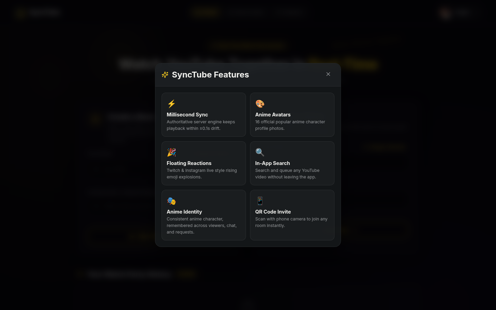
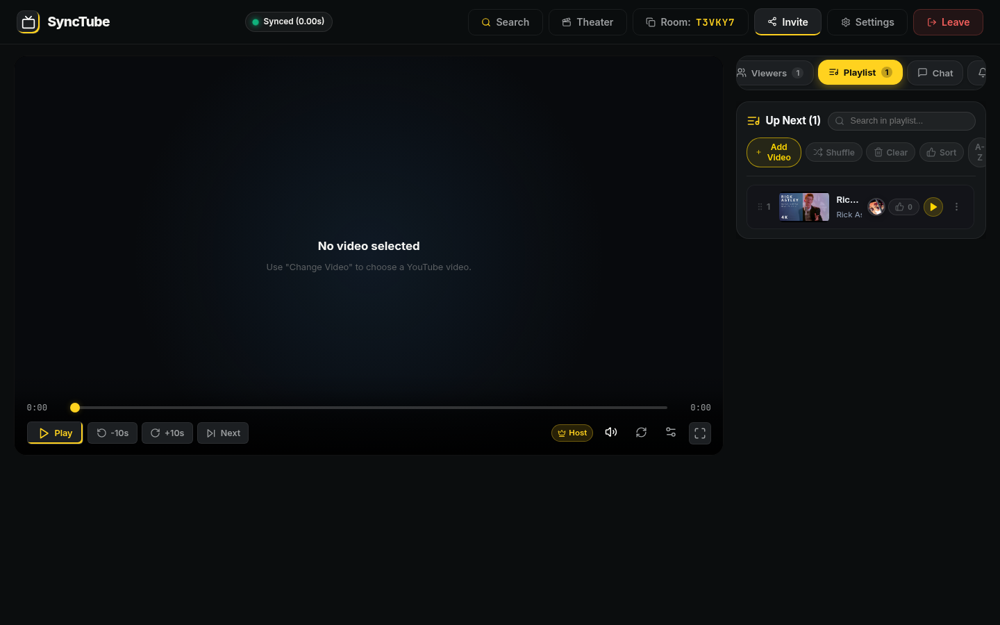
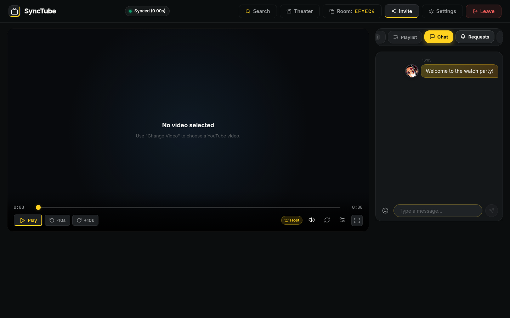
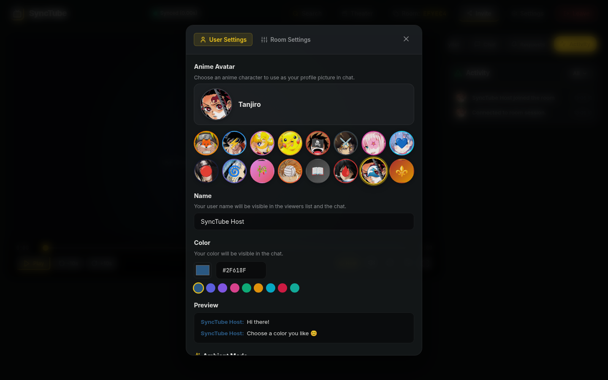
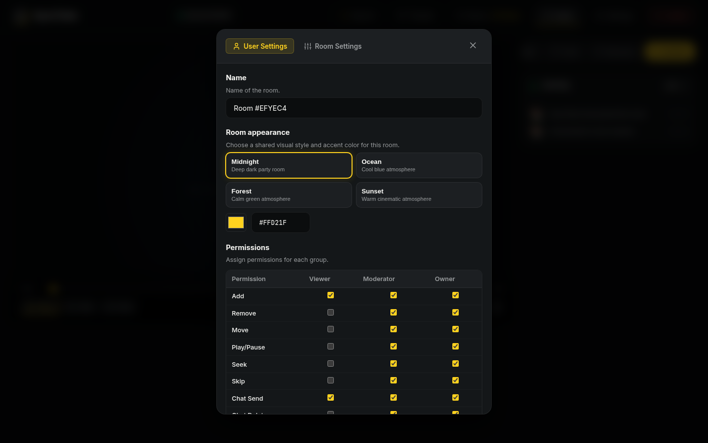
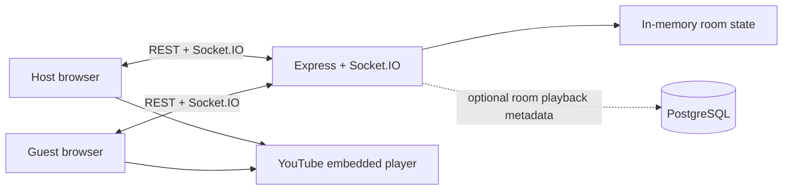

# SyncTube

**Watch YouTube together, in sync.** Create a room, invite friends, and enjoy shared playback, a collaborative queue, chat, polls, and live reactions from your browser.

[Open SyncTube](https://sync-tube-tqda.vercel.app) · [Backend health](https://youtube-watch-party-api-buaf.onrender.com/health)

SyncTube is a responsive, browser-based watch-party application. A room has a shared playback state and participant roles; each guest joins with a room code or invite link. No account is needed to try the app.

> **YouTube note:** SyncTube embeds videos using YouTube's player. A video may be unavailable if its owner disables embedding, it is restricted in your region, or YouTube requires the viewer to sign in. SyncTube does not host or distribute video files.

## Screenshots

Screenshots below were captured from the local app at the listed viewport sizes. The room screenshots show the empty-player state so the room controls and layout remain visible; choose a video in the live app to start watching.

### Home page at different sizes

| Phone · 390 × 844 | Tablet · 834 × 1112 | Desktop · 1440 × 900 |
|---|---|---|
| <a href="client/public/screenshots/readme/home-phone.png"></a> | <a href="client/public/screenshots/readme/home-tablet.png"></a> | <a href="client/public/screenshots/readme/home-desktop.png"></a> |

### Home page guides

| How it works | Feature overview |
|---|---|
| <a href="client/public/screenshots/readme/home-how-it-works.png"></a> | <a href="client/public/screenshots/readme/home-features.png"></a> |

### Watch room at different sizes

| Phone · 390 × 844 | Tablet · 834 × 1112 | Desktop · 1440 × 900 |
|---|---|---|
| <a href="client/public/screenshots/readme/room-phone.png"></a> | <a href="client/public/screenshots/readme/room-tablet.png"></a> | <a href="client/public/screenshots/readme/room-desktop.png"></a> |

On narrow screens, the room uses a dedicated playback dock and horizontally scrollable room tabs. On wider screens, the video stage and room sidebar appear side by side.

### Room tabs

| Participants | Playlist | Chat |
|---|---|---|
| <a href="client/public/screenshots/readme/room-participants.png"></a> | <a href="client/public/screenshots/readme/room-playlist.png"></a> | <a href="client/public/screenshots/readme/room-chat.png"></a> |

| Action requests | Activity |
|---|---|
| <a href="client/public/screenshots/readme/room-requests.png"></a> | <a href="client/public/screenshots/readme/room-activity.png"></a> |

### Search, invitations, and settings

| YouTube search | Invite friends |
|---|---|
| <a href="client/public/screenshots/readme/search.png"></a> | <a href="client/public/screenshots/readme/invite.png"></a> |

| User settings | Room settings |
|---|---|
| <a href="client/public/screenshots/readme/settings-user.png"></a> | <a href="client/public/screenshots/readme/settings-room.png"></a> |

The invite image contains a temporary room code and a local development link. Create an invite in the live app to get a usable link for your own room.

## Features

### Create, join, and return to rooms

- **Create a room** with an optional YouTube video URL or 11-character video ID. The creator becomes the host.
- **Join a room** with its room code. A room link can also pre-fill the join form.
- **Invite friends** with a copyable room code, direct link, QR code, or the WhatsApp and Telegram share actions.
- **Return to recent rooms** from watch-party history saved in the current browser. The list can be filtered by the entered profile name, and individual rooms or the history can be removed.
- **Reconnect as the room creator** using a room-specific identity credential stored by the browser.

### Synchronized video playback

- Share play, pause, seek, and video changes with everyone in the room.
- Keep room playback aligned with server-authoritative state and periodic time synchronization.
- Use the video timeline, **10-second skip controls**, and next-video action.
- Hosts and moderators can control playback; participants can send action requests for host/moderator approval.
- Choose available YouTube playback quality, toggle captions, mute locally, and use supported playback-speed controls.
- See a live sync-quality indicator and use the resync action when needed.
- Use fullscreen and theater (dimmed-page) modes. **Ambient mode** is off by default; enable it in user settings to spread colors sampled from the current video's thumbnail around the player, with adjustable blur and spread controls.
- On phones, use the separate playback dock designed for touch screens.

YouTube itself controls the embedded player, including video availability, ads, autoplay restrictions, captions, and supported quality levels.

### Cinema section: movies, web series & anime (MovieBox backend)

- Browse the in-room **Cinema** tab in the search dialog with four catalogue categories: **🔥 Trending**, **🎬 Movies**, **📺 Web Series**, and **🍥 Anime**, plus genre quick-search chips.
- The server resolves live stream links through the MovieBox API (the provider used by [MovieBox-Tui](https://github.com/mesamirh/MovieBox-Tui)): search, details, seasons/episodes, and play-info/resources endpoints.
- Pick a **video quality like YouTube** before you press play: a quality menu lists **Auto (adaptive)**, **4K**, **1080p**, **720p**, **480p**, … with format, codec, and size chips for each option.
- Quality rungs come from MovieBox `collectionResolutions` and per-resolution resource pages; adaptive titles stream through a proxied DASH manifest whose ladder can also be locked from the player's quality gear during playback.
- Series open a season/episode picker first; each episode resolves its own quality ladder before playback or queueing.
- Streams play through the synchronized HTML5/DASH player, so hosts, moderators, and participant requests all share the same room timeline; multi-language subtitles returned by the provider are available on the resolved streams.
- All media is proxied server-side with SSRF guards and an allow-list of media hosts; SyncTube does not host or distribute video files.
- Offline demo: run the server with `MOVIEBOX_FIXTURE=1` to browse a sample catalogue (movies, series, and anime) backed by local demo streams in `server/fixture-media` instead of the live MovieBox API.

### Shared playlist and video search

- Find videos with the in-room YouTube search, use a suggested search, or add a YouTube URL/video ID.
- Add videos to the shared **Up Next** list and see who added each item.
- Vote on playlist entries and sort the view by vote count or alphabetically.
- Hosts and moderators can play an entry, move it to the top, reorder it, remove entries, shuffle the queue, or clear the list.
- Configure playlist behavior in the room settings UI, including shuffle and removal of played entries.

### Roles and room moderation

- **Host:** owns the room controls, assigns participant roles, and can remove participants.
- **Moderator:** can control shared playback and manage playlist items.
- **Participant:** can join the room, chat, react, vote, add to the playlist, and request host-controlled playback actions.
- Hosts can review participant requests to play, pause, seek, change video, or queue a video next.
- Participant cards show profile avatars and role badges. If the host leaves, the server elects a replacement host from the remaining participants.

### Chat, polls, reactions, and activity

- Send room chat messages and reply to another message.
- React to chat messages with emoji, or send animated floating reactions over the video stage.
- Create a room poll, vote, and see live vote totals update.
- Send supported soundboard effects to the room.
- Follow join, leave, connection, and playback events in the activity feed.
- Chat history, active polls, playlist contents, and room participants are shared with users while they are connected to the same running room.

### Profile and appearance

- Choose an anime-style avatar, display name, and chat color.
- Preview profile colors in the user settings panel.
- Set ambient mode and local playback preferences without changing another viewer's local player settings.
- Select a room appearance theme and accent color in the room settings UI.

## Start a watch party

1. Open [SyncTube](https://sync-tube-tqda.vercel.app).
2. Enter your name. Optionally choose a profile avatar.
3. Select **Start Watch Party** to create a room. Add a YouTube URL first if you want the room to open with a video selected.
4. In the room, choose **Invite** and copy the room link, share the code, or display the QR code.
5. Your friends open the link (or enter the room code on the home page) and choose a display name.
6. Search for a video or add one to the shared playlist, then use playback controls and chat together.

The host can play videos immediately. Participants can use the request controls when they want the host or a moderator to approve a playback action.

## Run locally

### Requirements

- Node.js 22.12+ in the 22.x line, 24.x, or 26+ (including the production server container)
- npm

### Install and start

From the repository root:

```bash
npm install
npm run dev
```

The development command starts both the API/Socket.IO server and the Vite client. Open **http://localhost:5173** in your browser. The server listens on **http://localhost:10000** by default, and Vite proxies local API and Socket.IO traffic to it.

To start the services separately, use two terminals:

```bash
# Terminal 1: API and Socket.IO server
npm run dev -w server
```

```bash
# Terminal 2: Vite client
npm run dev -w client
```

### Environment configuration

Copy `.env.example` to `.env` if you need to override defaults. Do not commit real credentials or secret keys.

| Variable | Used by | Purpose |
|---|---|---|
| `PORT` | Server | HTTP and Socket.IO port; defaults to `10000`. |
| `NODE_ENV` | Server | Set to `production` for production proxy/CORS behavior. |
| `FRONTEND_URL` | Server | Explicit frontend origin allowed by the production CORS policy. |
| `DATABASE_URL` | Server | Optional PostgreSQL connection string. Without it, server room state runs in memory. |
| `VITE_API_URL` | Client | Optional API base URL. Local development uses Vite's `/api` proxy. |
| `VITE_SOCKET_URL` | Client | Optional Socket.IO server URL. Local development connects to the Vite origin. |

For a production deployment, configure the frontend API and socket URLs to point to the public backend when the frontend and backend use different origins. Only set production origins you control.

## Scripts

Run from the repository root unless the command says otherwise. Before the first browser test run, install Playwright's Chromium with `npm run test:e2e:install` (on Linux, use `npx playwright install --with-deps chromium` if system libraries are missing). E2E screenshots are written under `test-results/artifacts`; set `PLAYWRIGHT_ARTIFACTS_DIR` to override that location.

| Command | Description |
|---|---|
| `npm run dev` | Start frontend and backend together. |
| `npm run dev -w client` | Start the Vite frontend. |
| `npm run dev -w server` | Start the API and Socket.IO server. |
| `npm run build` | Build the server and frontend for production. |
| `npm test` | Run the server, client, and extension unit-test suites. |
| `npm run test:e2e:install` | Install Playwright's bundled Chromium browser (one-time setup). |
| `npm run test:e2e` | Build the extension and run the Playwright end-to-end suite. |

## Project structure

```text
client/
  src/
    components/   Player, playlist, chat, participants, settings, invite, and more
    pages/        HomePage and RoomPage
    services/     Socket.IO client and error reporting
    utils/        YouTube IDs, browser identity, avatars, and local room history
    __tests__/    Client unit tests
  public/
    screenshots/  README screenshots
server/
  src/
    app.ts         Express API, CORS, security headers, and rate limits
    socket/        Validated real-time room events and Socket.IO handlers
    models/        In-memory room and participant state
    services/      PostgreSQL, permissions, and error reporting
    __tests__/     API, room, socket, permission, and utility tests
```

## Architecture



- **Client:** React, TypeScript, and Vite.
- **Realtime server:** Express and Socket.IO, with Zod schemas for socket event payloads.
- **Database:** PostgreSQL is optional and stores room playback metadata. Browser-local settings and room history use local storage.
- **Tests:** Vitest for unit/API/socket tests and Playwright for browser end-to-end checks.

## Temporary Browser (Ephemeral Isolated Remote Browser)

SyncTube includes a built-in **Temporary Browser** feature for private, zero-trace web browsing directly within your browser.

### How It Works & Architecture
- **Engine:** Spawns an isolated headless Chromium instance on the backend for each session using Playwright.
- **Remote Display:** Uses Chrome DevTools Protocol (CDP) `Page.startScreencast` to stream live JPEG frames at ~30 FPS over authenticated Socket.IO WebSockets.
- **Interactive Control:** Dispatches mouse movements, clicks, scrolling (wheel), and keyboard typing directly into the remote Chromium page in real time with precise coordinate mapping.
- **Ephemeral Sandbox:**
  - Every session gets a dedicated temporary user directory in `/tmp/synctube-tb-<id>`.
  - Zero database persistence: cookies, cache, authentication state, and history are never written to any database.
  - On "Close & Delete Session": the remote Chromium process is terminated, CDP detached, temporary disk directory wiped with `rmSync`, and session token revoked.
  - Inactivity Timeout: Sessions automatically terminate and wipe after 8 minutes of idle time or 15 minutes max lifetime.

### Security & SSRF Protection
- **Protocol Enforcement:** Only `http:` and `https:` schemes are allowed. Schemes like `file:`, `javascript:`, `data:`, `blob:`, and `gopher:` are blocked.
- **SSRF Network Blocking:** Restricts navigation to private IPs (`10.0.0.0/8`, `172.16.0.0/12`, `192.168.0.0/16`, `127.0.0.0/8`, `0.0.0.0`), loopback (`localhost`), link-local (`169.254.0.0/16` AWS/GCP/Render metadata endpoints), and IPv6 equivalents (`::1`, `fc00::/7`).
- **DNS Resolution Verification:** Resolves hostnames before navigation to prevent DNS rebinding attacks to internal infrastructure.
- **Token Authorization:** Each session is assigned a cryptographically random session token required for both REST API endpoints and Socket.IO events.

### API Endpoints
- `POST /api/sessions` — Start an isolated session (`{ initialUrl, viewport }`). Rate limited.
- `GET /api/sessions/:id` — Query session status (requires `Authorization: Bearer <token>`).
- `POST /api/sessions/:id/navigate` — Navigate to URL with SSRF validation.
- `DELETE /api/sessions/:id` — Terminate Chromium, wipe temporary directory, and invalidate token.
- `Socket.IO` — Events for `browser:join`, `browser:frame`, `browser:navigated`, `browser:mouse_move`, `browser:click`, `browser:wheel`, `browser:key_down`, and `browser:close`.

### Deployment & Free-Tier Hosting Constraints
- **Backend (Render):** Deploy using the included `Dockerfile` (or Docker web service) so Chromium and its required Linux dependencies (`chromium`, `libasound2`, `libnss3`, etc.) are packaged with the container.
- **Frontend (Vercel):** Deploy `client/` as a static Vite site with `VITE_API_URL` pointing to your Render backend.
- **Free-Tier Limits:**
  - Render free tier provides 512 MB RAM. Running Chromium sessions requires ~80-120 MB RAM per active tab. The server enforces `MAX_CONCURRENT_BROWSER_SESSIONS=5` by default to avoid OOM errors.
  - If Render puts the service to sleep after 15 minutes of inactivity, initial session spin-up may take 30-45 seconds for a cold boot.
  - Heavy video playback (e.g. 4K streams) inside the remote browser may hit CPU limits on single-core free tier instances; standard browsing, research, and interactive navigation perform smoothly.

## Data and deployment notes

- No sign-in or user-account system is required. Profile details, recent rooms, and some preferences are kept in that browser's local storage.
- The server keeps connected participants, chat, playlist, polls, reactions, and action requests in memory. These live room features are not durable across a server restart.
- When `DATABASE_URL` is configured, PostgreSQL stores basic room playback metadata (room ID, video ID, play state, current position, and update time). It does **not** persist chat, playlist, polls, participant presence, or every room setting.
- The room settings panel includes visual and permission options, but the full settings matrix is currently client-side; it is not synchronized or persisted as shared room configuration.
- The default in-memory room model is suited to a single server instance. Running multiple backend instances requires shared Socket.IO state and shared room storage before rooms can be coordinated across instances.
- The hosted frontend is on Vercel and the room service is on Render. Both deployments are configured to follow `main`; check the repository's Actions/deployment status for the current result.
- Express API routes have request limits. Production CORS is restricted to configured/allowed origins.

## Troubleshooting

| Symptom | What to check |
|---|---|
| The room does not connect | Confirm the backend is running, the frontend points to the right API/socket origin, and your network allows WebSocket connections. |
| A room code is not found | Room codes refer to rooms on the active backend. Confirm the code and that the room is still available. |
| The video is unavailable | Try another video. The video's owner may have disabled embedding, or YouTube may restrict it in your region/account. |
| There is no sound or playback does not start | Check the local mute control and browser permissions. Some browsers block autoplay until the viewer interacts with the player. |
| Playback appears out of sync | Check your connection and use the room's resync control. Buffering and network delay can affect embedded YouTube playback. |
| Search returns no results | Try a more specific title or paste a YouTube URL/video ID directly. Search availability depends on the external YouTube page/service. |

## Contributing

1. Create a branch for your change.
2. Keep changes focused and add or update tests for behavior changes.
3. Run `npm test` and `npm run build` before opening a pull request.

For bugs, include the browser/device, steps to reproduce, and relevant console or server output. Do not include access tokens, `.env` contents, or other secrets in reports.
