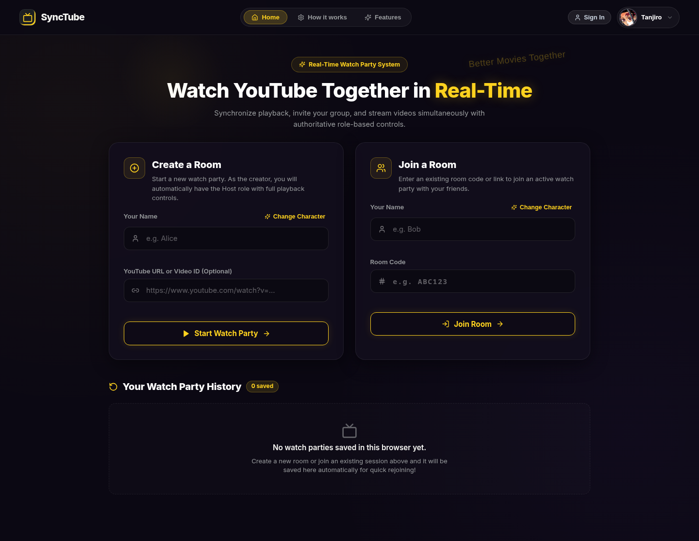
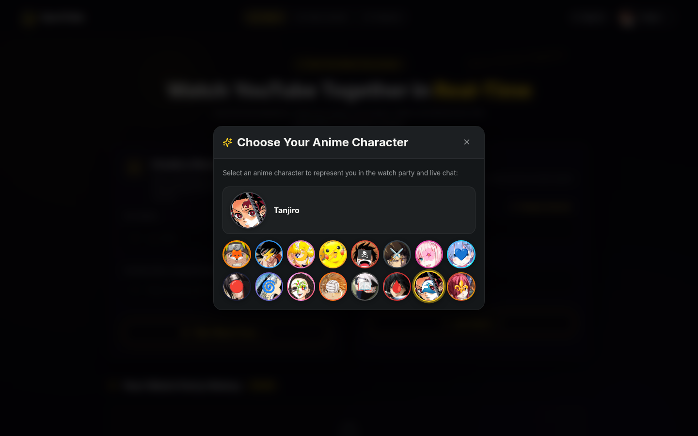
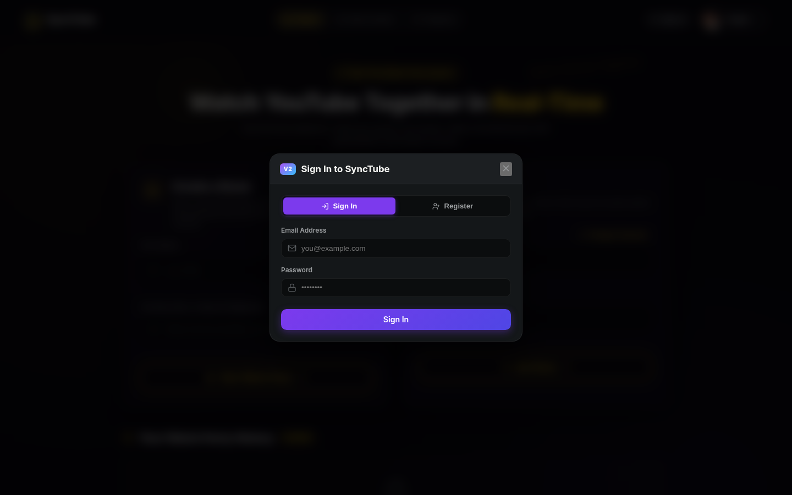
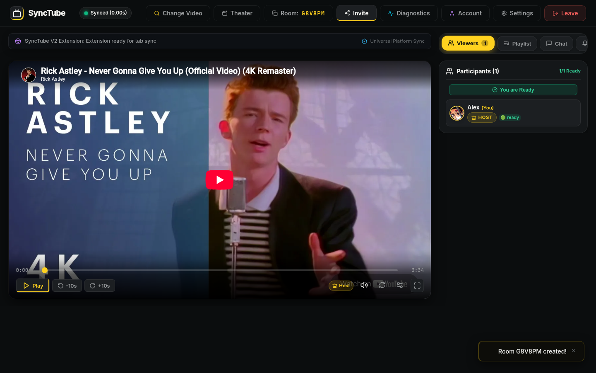
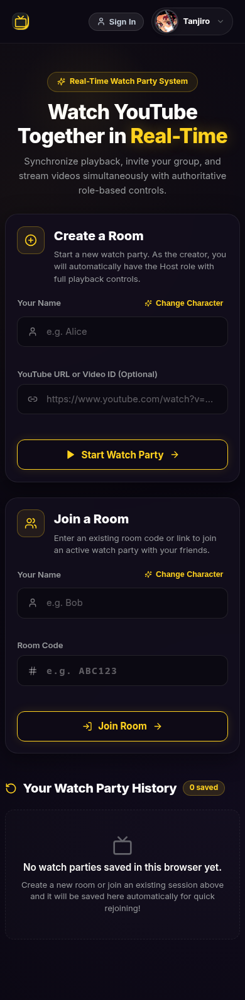

# SyncTube UI Inspection Report

**Date**: 2026-10-08  
**URL**: [http://localhost:5173](http://localhost:5173)  
**Backend**: [http://localhost:10000](http://localhost:10000)  

---

## Executive Summary
SyncTube features a sleek, modern dark UI aesthetic with high-contrast glowing gold (`#fbbf24`) callouts, glassmorphic card containers, anime character avatars, and a real-time synchronized video room experience.

During automated UI testing and visual verification, **0 runtime console errors** and **0 failed network requests** were observed.

---

## 1. Homepage & Landing Page



### Design & Architecture Highlights:
- **Navigation Bar**: Minimal dark header with the SyncTube retro TV badge, quick navigation (`Home`, `How it works`, `Features`), `Sign In` action, and current anime character profile badge (`Tanjiro`).
- **Hero Unit**: Clear headline *"Watch YouTube Together in Real-Time"* featuring a yellow/gold gradient glow and floating badge *"Real-Time Watch Party System"*.
- **Split Action Cards**:
  - **Create a Room**: Dedicated card specifying host permissions, customizable participant name, anime character picker shortcut, optional YouTube video URL/ID input, and primary golden *"Start Watch Party"* button.
  - **Join a Room**: Secondary card with participant name, Room Code input (`# e.g. ABC123`), and clean outlined *"Join Room"* button.
- **Session History**: Saved watch parties container with empty state graphic and guidance text.

---

## 2. Anime Character Customizer



### Features:
- Smooth dark backdrop blur separating background content.
- Interactive avatar grid featuring 14+ anime characters (Tanjiro, Naruto, Luffy, Levi, Rem, Nezuko, Gojo, Deku, etc.).
- Active selection ring with real-time name preview.

---

## 3. User Authentication (Sign In & Register)



### Features:
- Pill toggle between **Sign In** and **Register**.
- Clear icon-assisted form inputs for Email and Password.
- Modern purple primary action button to visually distinguish authentication from party creation.

---

## 4. Active Watch Party Room View



### Room Layout & Controls:
- **Top Bar**:
  - Live latency & sync indicator: `Synced (0.00s)` badge in green.
  - Action toolbar: `Change Video`, `Theater Mode`, `Room Code` (with copy-to-clipboard), `Invite`, `Diagnostics`, `Account`, `Settings`, and `Leave` (red accent).
- **Extension Status Banner**: Notifies participants whether the browser extension is connected for cross-platform tab sync.
- **Synchronized Video Player**:
  - 16:9 embedded YouTube player.
  - Custom overlay toolbar with Play/Pause, ±10s skips, scrubber with current time & total duration, Host badge, volume, and fullscreen.
- **Multi-Tab Sidebar**:
  - Tab navigation: `Viewers (1)`, `Playlist`, and `Chat`.
  - Participant item with avatar, host badge, and ready state toggle (`You are Ready`).
- **Toast Notifications**: Bottom-right notification confirming room creation and actions.

---

## 5. Mobile Responsiveness (390px Viewport)



### Highlights:
- Responsive single-column card layout.
- Touch-friendly sizing for buttons and input fields.
- Fully adaptive header controls with zero horizontal overflow.

---

## Test & Runtime Diagnostics
- **Browser Tested**: Google Chrome / Headless Chromium
- **Console Log Summary**:
  ```json
  [
    "[debug] [vite] connecting...",
    "[debug] [vite] connected."
  ]
  ```
- **Error Count**: 0 errors
- **WebSocket Status**: Successfully connected and synchronized with server on port 10000.
